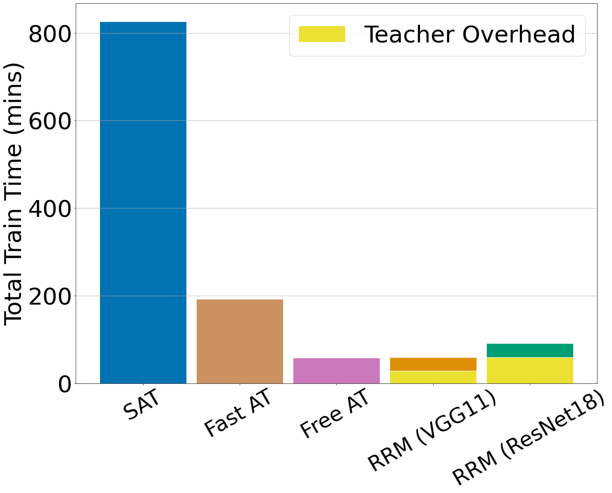

# Robust Representation Matching (RRM)

This repository contains the code and models necessary to replicate the results of our USENIX'22 paper:

**Transferring Adversarial Robustness Through Robust Representation Matching**

*Pratik Vaishnavi, Kevin Eykholt, Amir Rahmati*

**Paper**: https://arxiv.org/abs/2202.09994

**Abstract**: 
With the widespread use of machine learning, concerns over its security and reliability have become prevalent. As such, many have developed defenses to harden neural networks against adversarial examples, imperceptibly perturbed inputs that are reliably misclassified. Adversarial training in which adversarial examples are generated and used during training is one of the few known defenses able to reliably withstand such attacks against neural networks. However, adversarial training imposes a significant training overhead and scales poorly with model complexity and input dimension. In this paper, we propose Robust Representation Matching (RRM), a low-cost method to transfer the robustness of an adversarially trained model to a new model being trained for the same task irrespective of architectural differences. Inspired by student-teacher learning, our method introduces a novel training loss that encourages the student to learn the teacher’s robust representations. Compared to prior works, RRM is superior with respect to both model performance and adversarial training time. On CIFAR-10, RRM trains a robust model ∼1.8× faster than the state-of-the-art. Furthermore, RRM remains effective on higher-dimensional datasets. On Restricted-ImageNet, RRM trains a ResNet50 model ∼18×faster than standard adversarial training.

## Key Results from the Paper
* Comparing the performance and training time of a robust ResNet50 trained with different approaches. The teachers used for RRM models are noted in the parentheses. The adversarial accuracy evaluation is done using an L∞-bound AutoPGD attack with ε = 8/255, 50 iterations and 10 random restarts. Compared to SAT, RRM achieves significant speedup while maintaining comparable adversarial accuracy and suffering minor drop in natural accuracy. Compared to Free AT, RRM achieves better natural and adversarial accuracy while converging ∼1.8× faster.

<p align="center">

</p>

* Comparing total training times of SAT, Fast AT, and Free AT with RRM. Yellow regions represent the total time of adversarially training a teacher. If an adversarially robust teacher is already trained, the total training time of RRM is decreased significantly.

<p align="center">

</p>

* Comparing the performance and training time of a robust ResNet50 and VGG16 models trained using SAT and RRM. An AlexNet model trained using SAT is used as teacher for RRM. The adversarial accuracy evaluation is done using an L2-bound AutoPGD attack with ε = 3, 20 iterations, and 5 random restarts

<p align="center">

</p>


## Overview of the Repository
Our source-code contains two main directories:

- **[robustness](https://github.com/pratik18v/robust-representation-matching/tree/main/robustness)**: The [robustness package](https://github.com/MadryLab/robustness) by MadryLab with some modifications to support our experiments.

- **[l_inf](https://github.com/pratik18v/robust-representation-matching/tree/main/l_inf):** contains scripts used to generate results from Table 1 and Figures 2, 3, and 4 from the main paper.
	- `train_pgd.py`: train a classifier using fast version of SAT (Madry et al.).
	- `train_free.py`: train a classifier using fast version of Free-AT (Shafahi et al.).
	- `train_rrm.py`: train a classifier using RRM.
	- `test.py`: perform evaluation using manual attack implementation.
	- `ibm_test.py`: perform evaluation using [IBM ART](https://github.com/Trusted-AI/adversarial-robustness-toolbox)'s attack implementation.
- **[l_2](https://github.com/pratik18v/robust-representation-matching/tree/main/l_2):** contains scripts used to generate results from Tables 2, 3 and Figure 5 from the main paper.
	- `train_rrm.py`: train a classifier using RRM.
	- `train_kdloss.py`: train a classifier using knowledge distillation loss.
	- `test.py`: perform evaluation using manual attack implementation.
	- `ibm_test.py`: perform evaluation using [IBM ART](https://github.com/Trusted-AI/adversarial-robustness-toolbox)'s attack implementation.


The code in this repository borrows heavily from the following open-source repositories:

- [robustness package](https://github.com/MadryLab/robustness) (by MadryLab)
- [fast_adversarial](https://github.com/locuslab/fast_adversarial) (by locuslab)

## Quickstart

1. Clone the repository

```git clone https://github.com/pratik18v/robust-representation-matching.git```

2. Create virtualenv and install dependencies

``` 
conda create -n rrm python=3.6 --file requirements.txt
conda activate rrm
```

3. Download one of our pre-trained models from [here](https://drive.google.com/drive/folders/1-DiQyeu5IaVe9GC9WURwcRBTzf2eD3th?usp=sharing).
4. To evaluate a resnet50 classfier's robustness against the AutoPGD attack, run one of the following commands:

```
# 1. For cifar10 classifiers trained under the l_inf threat model
python -m l_inf.ibm_test --dataroot /path/to/cifar --arch resnet50 --load-path /path/to/checkpoint.pt --attack autopgd --pgd-iters 50 --random-restarts 10

# 2a. For cifar10 classifiers trained under the l_2 threat model
python -m l_2.ibm_test --dataroot /path/to/cifar --arch resnet50 --load-path /path/to/checkpoint.pt --attack autopgd --eps 1.0 --pgd-iters 50 --random-restarts 10

# 2b. For restricted_imagenet classifiers trained under the l_2 threat model
python -m l_2.ibm_test --dataroot /path/to/imagenet/root --arch resnet50 --load-path /path/to/checkpoint.pt --attack autopgd --eps 3.0 --pgd-iters 20 --random-restarts 5
```

## Citation
If you use the code in this repository for your research, please cite our paper using the bibtex below.

```
@inproceedings{vaishnavi2022transferring,
      title={Transferring Adversarial Robustness Through Robust Representation Matching}, 
      author={Pratik Vaishnavi and Kevin Eykholt and Amir Rahmati},
      booktitle={31st USENIX Security Symposium (USENIX Security 22)},
}
```

