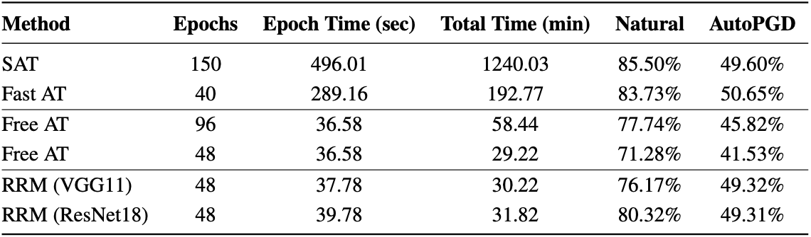
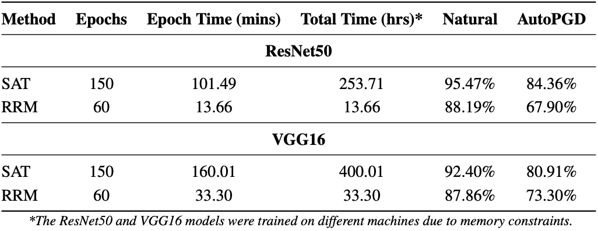

#Robust Representation Matching (RRM)

This repository contains the code and models necessary to replicate the results of our USENIX'22 paper:

**Transferring Adversarial Robustness Through Robust Representation Matching**

*Pratik Vaishnavi, Kevin Eykholt, Amir Rahmati*

**Paper**: \<insert_link\>

**Abstract**: 
With the widespread use of machine learning, concerns over its security and reliability have become prevalent. As such, many have developed defenses to harden neural networks against adversarial examples, imperceptibly perturbed inputs that are reliably misclassified. Adversarial training in which adversarial examples are generated and used during training is one of the few known defenses able to reliably withstand such attacks against neural networks. However, adversarial training imposes a significant training overhead and scales poorly with model complexity and input dimension. In this paper, we propose Robust Representation Matching (RRM), a low-cost method to transfer the robustness of an adversarially trained model to a new model being trained for the same task irrespective of architectural differences. Inspired by student-teacher learning, our method introduces a novel training loss that encourages the student to learn the teacher’s robust representations. Compared to prior works, RRM is superior with respect to both model performance and adversarial training time. On CIFAR-10, RRM trains a robust model ∼1.8× faster than the state-of-the-art. Furthermore, RRM remains effective on higher-dimensional datasets. On Restricted-ImageNet, RRM trains a ResNet50 model ∼18×faster than standard adversarial training.

## Key Results from the Paper
* Comparing the performance and training time of a robust ResNet50 trained with different approaches. The teachers used for RRM models are noted in the parentheses. The adversarial accuracy evaluation is done using an L∞-bound AutoPGD attack with ε = 8/255, 50 iterations and 10 random restarts. Compared to SAT, RRM achieves significant speedup while maintaining comparable adversarial accuracy and suffering minor drop in natural accuracy. Compared to Free AT, RRM achieves better natural and adversarial accuracy while converging ∼1.8× faster.

<p align="center">

</p>

* Comparing total training times of SAT, Fast AT, and Free AT with RRM. Yellow regions represent the total time of adversarially training a teacher. If an adversarially robust teacher is already trained, the total training time of RRM is decreased significantly.

<p align="center">

</p>

* Comparing the performance and training time of a robust ResNet50 and VGG16 models trained using SAT and RRM. An AlexNet model trained using SAT is used as teacher for RRM. The adversarial accuracy evaluation is done using an L2-bound AutoPGD attack with ε = 3, 20 iterations, and 5 random restarts

<p align="center">

</p>


## Overview of the Repository
Our source-code contains two main directories:

- **l_infty:** contains scripts used to generate results from Table 1 and Figures 2, 3, and 4 from the main paper.
	- `train_pgd.py`: train a classifier using fast version of SAT (Madry et al.)
	- `train_free.py`: train a classifier using fast version of Free-AT (Shafahi et al.)
	- `train_rrm.py`: train a classifier using RRM.
	- `test.py`: perform evaluation using manual attack implementation
	- `ibm_test.py`: perform evaluation using [IBM ART](https://github.com/Trusted-AI/adversarial-robustness-toolbox)'s attack implementation
- **l_2:** contains scripts used to generate results from Tables 2, 3 and Figure 5 from the main paper.


Our code borrows heavily from the following open-source repositories:

- [robustness package](https://github.com/MadryLab/robustness) (by MadryLab)
- [fast_adversarial](https://github.com/locuslab/fast_adversarial) (by locuslab)

## Getting Started

1. Clone the repository

```git clone https://github.com/pratik18v/robust-representation-matching.git```

2. Install dependencies

```
conda create -n smoothing-adversarial python=3.6
conda activate smoothing-adversarial
pip install -r requirements.txt
```

3. Download one of our pre-trained models from [here](). Create a directory named `checkpoints` in the project root directory and store the downloaded model there.
4. The following is an example to evaluate a pre-trained ResNet50 model:

```
# AutoPGD Attack using IBM ART
python ibm_test.py --arch resnet50 --load-path /path/to/checkpoint.pt.last --data-dir /path/to/cifar --attack auto_pgd --random-restarts 10 --pgd-iters 50
```

## Example

### Training
To train a resnet50 model on CIFAR-10 dataset, refer to the following example commands:

**1. fast SAT**

```python train_pgd.py --data-dir /path/to/cifar --arch resnet50```

**2. fast free-AT**

```python train_free.py --data-dir /path/to/cifar --arch resnet50```

**3. RRM (VGG11)**

- Train the VGG11 teacher using fast SAT:

```python train_pgd.py --data-dir /path/to/cifar --arch vgg11```

- Train the ResNet50 student using RRM and the previously trained VGG11 model:

```python train_rrm.py --data-dir /path/to/cifar --arch resnet50 --t-arch vgg11 --t-loadpath /path/to/teacher/checkpoint.pt.last --feat-loss cosine --xent-weight 0.005 --feat-weight -1```

### Evaluation

We provide two evaluation scripts in this repo:

* `test.py`: uses a manual implementation of the PGD attack.

```
# PGD Attack
python test.py --arch resnet50 --load-path /path/to/checkpoint.pt.last --data-dir /path/to/cifar --random-restarts 10 --pgd-iters 50
```

* `ibm_test.py`: uses [IBM's ART](https://github.com/Trusted-AI/adversarial-robustness-toolbox) to execute sate-of-the-art attacks like AutoPGD.

```
# PGD Attack
python ibm_test.py --arch resnet50 --load-path /path/to/checkpoint.pt.last --data-dir /path/to/cifar --attack pgd --random-restarts 10 --pgd-iters 50

# AutoPGD Attack
python ibm_test.py --arch resnet50 --load-path /path/to/checkpoint.pt.last --data-dir /path/to/cifar --attack auto_pgd --random-restarts 10 --pgd-iters 50

```

Both these scripts return accuracy on the clean test set by default.

## Acknowledgement
TBD